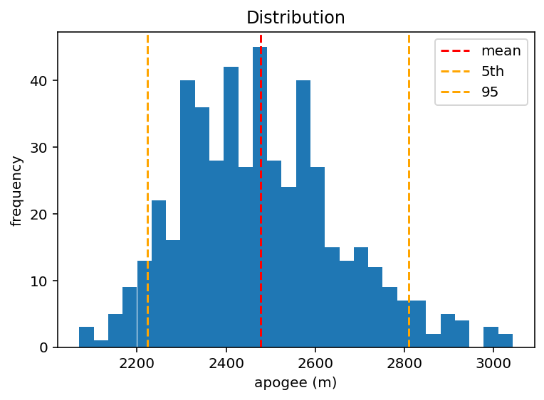
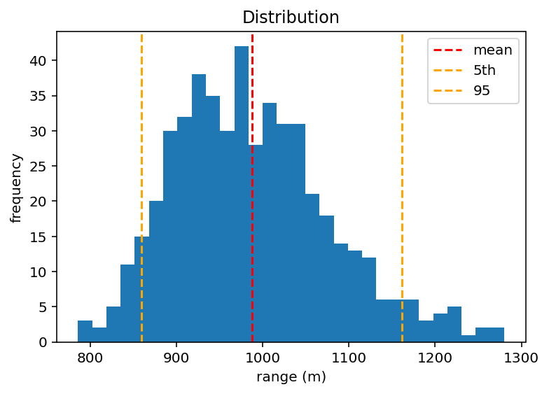

# Rocket-monte-carlo-sim
2D rocket flight simulator with a built in RK4 integrator and Monte Carlo dispersion analysis (Python)

## Key result
With realistic uncertainty in drag coefficient (10%) and dry mass (3%), a 500-run Monte Carlo simulation gives:

- **Apogee:** mean ~2478 m, with 90% of flights between 2224 m and 2810 m
- **Range:** mean ~988 m, with 90% of flights between 859 m and 1161 m

The dashed red line marks the mean; the orange lines mark the 5th and 95th percentiles (the 90% band).

## How it works

The rocket's state is a vector `[x, y, vx, vy, m]` — position, velocity, and mass — advanced through time by numerically integrating the equations of motion. Forces at each step are thrust (interpolated from a real motor thrust curve), drag (proportional to velocity squared and opposing the velocity vector, with air density falling off with altitude), gravity, and mass loss as propellant burns.

Integration is done with a hand-implemented RK4 method. Euler is included as a first-order baseline to show the accuracy gained by switching to RK4. The `simulate` function takes the integrator as an argument, so the two can be swapped directly. The Monte Carlo layer runs the simulation 500 times, each run drawing the uncertain inputs (drag coefficient, mass) from normal distributions around fixed nominal values, and collects the spread of outcomes rather than a single point estimate.yes

## What it does

- 2D flight dynamics with altitude-dependent air density and velocity-dependent drag
- Hand-implemented RK4 integrator, with Euler included as a baseline for comparison
- Sensitivity analysis: how apogee and range respond to launch angle
- Monte Carlo dispersion analysis: quantifies output uncertainty from uncertain inputs

## Running it
Requires `numpy` and `matplotlib`, and the thrust-curve file `AeroTech_HP-I140W.eng` in the same directory.

A fixed random seed makes the Monte Carlo results reproducible — the same run produces the same numbers each time.

